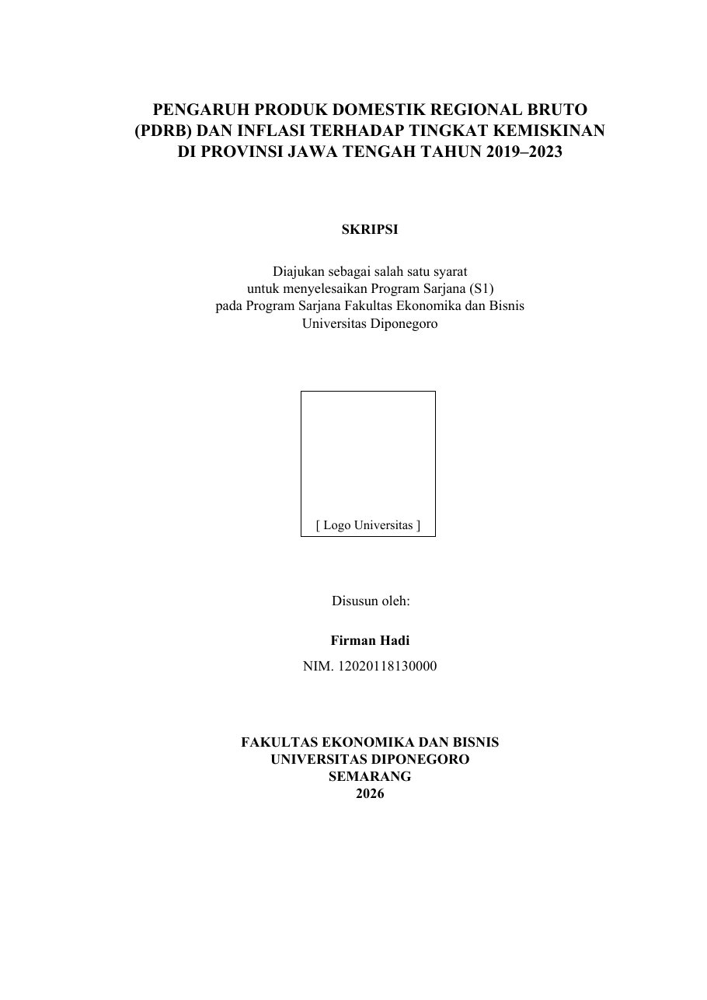
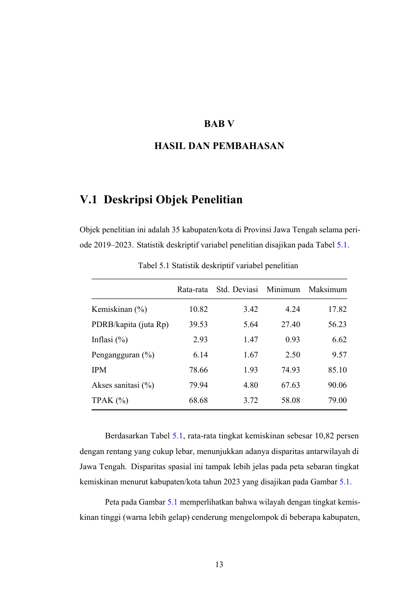
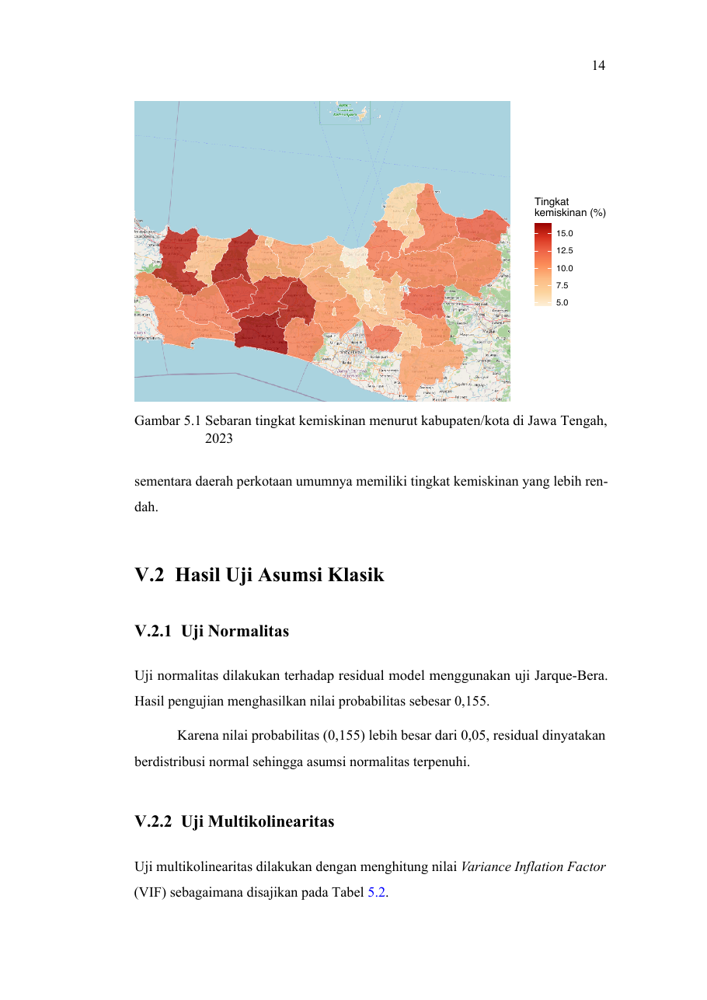

> 🌐 **English version:** [read this in English](en/skripsi.qmd)

Quarto bukan hanya untuk dokumen biasa — ia bisa menghasilkan **skripsi utuh** dengan
**tata letak cetak persis seperti skripsi**: sampul, halaman pengesahan, BAB I–V,
penomoran otomatis, daftar isi/tabel/gambar, hingga daftar pustaka. Anda menulis isi dan
analisis; Quarto mengurus format.

## Hasilnya: tata letak persis skripsi {#sec-layout}

Contoh di bawah dirender dari templat skripsi (studi kasus kemiskinan Jawa Tengah) —
**format cetaknya sama dengan skripsi sungguhan**:

::: {layout-ncol=2}
{.border}

{.border}
:::

Gambar, peta, dan uji statistik pun tampil dalam tata letak skripsi — semuanya **dihitung
dari data**, bukan ditempel manual:

{.border width="62%" fig-align="center"}

## Yang otomatis diurus Quarto

- **Halaman muka**: sampul, pengesahan, abstrak, kata pengantar.
- **Penomoran**: "BAB I–V", **Tabel 5.1 / Gambar 5.1**, persamaan — beserta **rujukan
  silang** (klik untuk melompat).
- **Daftar otomatis**: daftar isi, daftar tabel, daftar gambar.
- **Sitasi & daftar pustaka**: gaya APA (atau lain), terhubung **Zotero/`.bib`**.
- **Hasil analisis**: tabel deskriptif, grafik, peta, uji asumsi klasik, regresi — langsung
  dari kode + data (lihat halaman **[Analisis Data](analisis.qmd)**).

## Struktur proyek skripsi

```
skripsi/
├── _quarto.yml          # proyek "book": atur BAB, format PDF/Word
├── index.qmd            # halaman judul / abstrak
├── bab/
│   ├── 01-pendahuluan.qmd      # BAB I
│   ├── 02-tinjauan-pustaka.qmd # BAB II
│   ├── 03-metode.qmd           # BAB III
│   ├── 04-hasil.qmd            # BAB IV/V (analisis + pembahasan)
│   └── 05-penutup.qmd
├── data/                # data Anda (.csv, .geojson)
├── tex/preamble.tex     # gaya LaTeX (margin, font Times, penomoran BAB)
└── referensi.bib        # pustaka (ekspor dari Zotero)
```

## Cara pakai

1. **Ambil templat** siap pakai (R atau Python) — lihat *Unduh* di bawah.
2. **Tulis isi** tiap bab di `bab/*.qmd` (Markdown biasa + blok kode untuk analisis).
3. **Ganti data** Anda di `data/`.
4. **Render** → `PDF skripsi`. (Untuk Word: `--to docx`.)
5. **Data/variabel berubah?** Render ulang — tabel, grafik, peta, angka, dan daftar
   pustaka **otomatis menyesuaikan**.

::: {.callout-tip}
## Ganti format kampus
Aturan margin, jenis font (mis. **Times New Roman 12pt**), spasi 1,5, dan penomoran diatur
di `tex/preamble.tex` dan `_quarto.yml` — sesuaikan sekali, berlaku untuk seluruh skripsi.
:::

## Unduh & templat

- 📄 **[Unduh contoh skripsi (PDF)](skripsi/contoh-skripsi.pdf)** — 35 halaman, hasil
  render templat.
- 📦 **Unduh templat siap render (ZIP):**
  [Templat **R**](skripsi/template-skripsi-r.zip) ·
  [Templat **Python**](skripsi/template-skripsi-python.zip)
  — sudah lengkap dengan `bab/`, `data/`, `tex/preamble.tex`, `referensi.bib`, dan
  **slide sidang**.
- 🔎 **Lihat / kloning sumber templat** di repo workshop (publik):
  <https://github.com/firmanhadi21/quarto-workshop/tree/main/templates>
- 📘 **Buku lengkap "Quarto untuk Skripsi"** (panduan bab demi bab):
  <https://firmanhadi21.github.io/thesis-with-quarto/>

::: {.callout-note}
## Cara memakai ZIP
1. Unduh & ekstrak. 2. Buka folder di **RStudio** (klik `*.Rproj`). 3. Ganti isi `data/`
& tulis tiap bab di `bab/`. 4. Tekan **Render** → PDF skripsi.
:::
